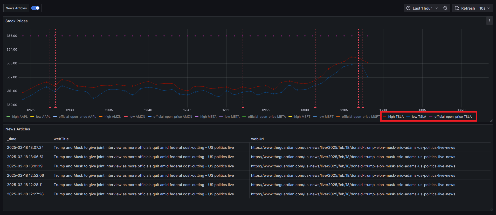
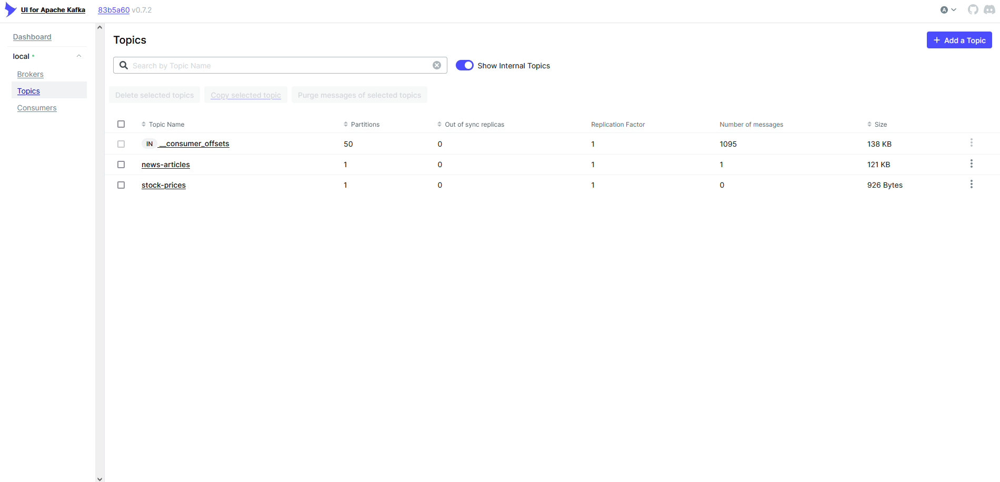
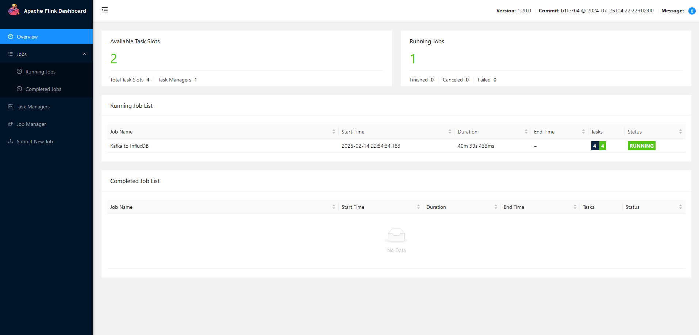
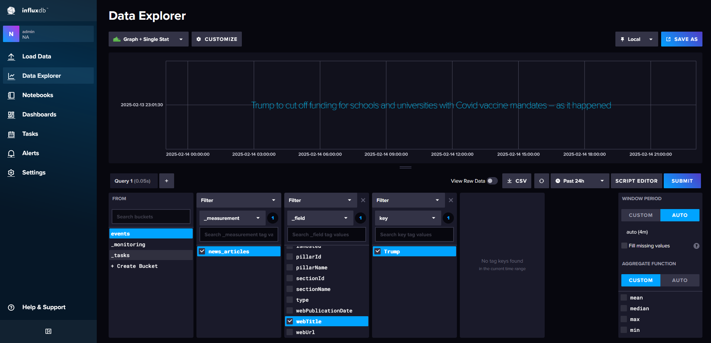
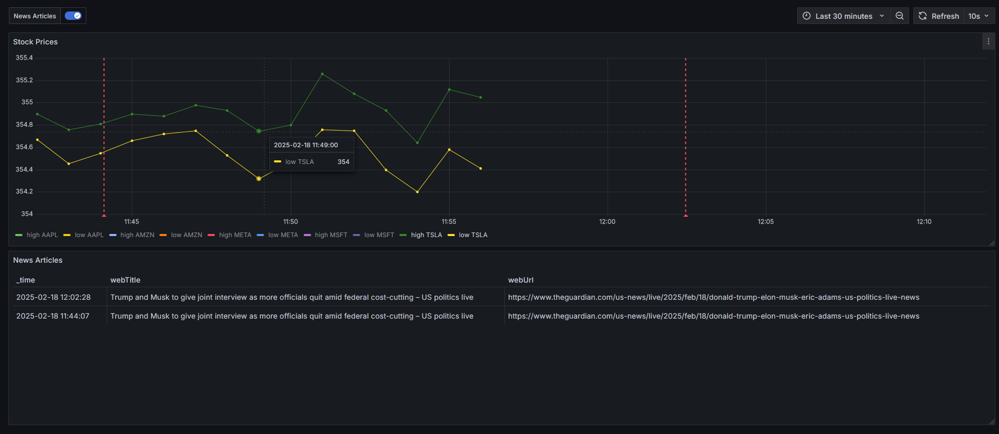
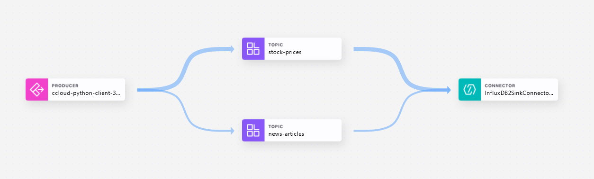
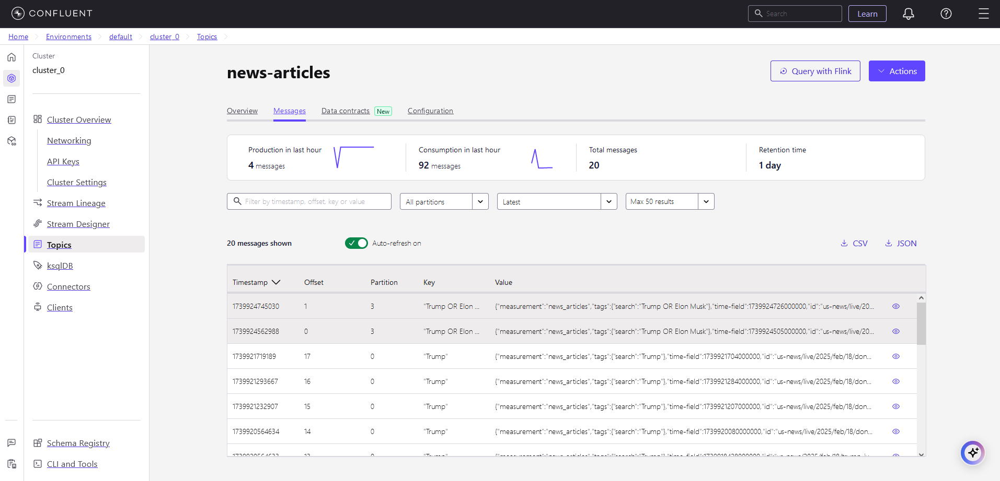
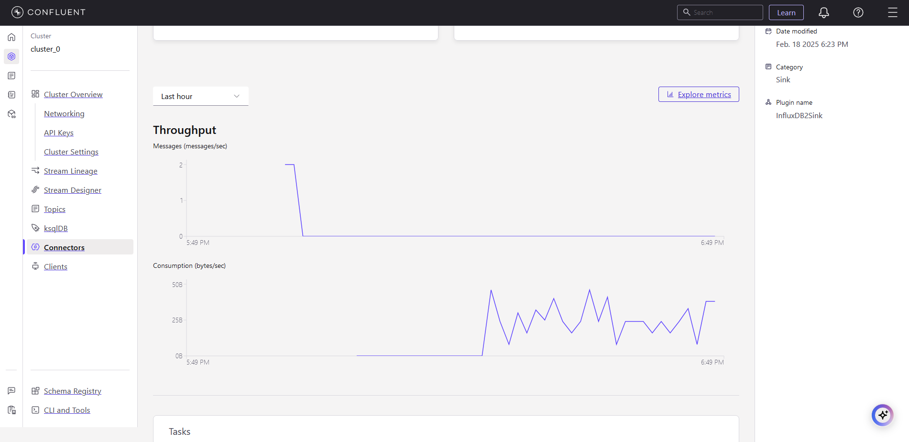

# Real-Time Stock Prices & News

This project utilizes Polygon's live stream and The Guardian's API to showcase real-time stock prices and news to watch for causation and signals. 

[](https://github.com/cmgoffena13/DE-Capstone-Portfolio-2/actions/workflows/build.yml)



<sup>Real-Time Dashboard - delayed by 15 minutes since I didn't want to pay to upgrade my Polygon subscription</sup>

## Technologies Used
 
 
 
  <!--![Iceberg](https://img.shields.io/badge/-Iceberg-lightblue?style=flat&logoColor=white&logo=data:image/png;base64,iVBORw0KGgoAAAANSUhEUgAAADAAAAAwCAYAAABXAvmHAAAACXBIWXMAAAsTAAALEwEAmpwYAAAFBUlEQVR4nO2ZXUxbZRjH3/Me5o1mJl6YXciFNxpjYlyMmuiFZjHGq+1yww23hbgxEOMKKR+DthQdzdg03knkYyDQljBgjBUQ+8HHoHyFAoXohcjYGMMMBFt66Okpj3lPP+jHaSlS2pL0nzxJeXrOef+/0/97njYglFRSSSUVSt3LjrL6eVaMDqO6F+GluQ0ne3eJ3SozMa+iwybDisPwcHMbptedIDPbB6V6SEGJrPvLzorSGbuCvNY8gY/mLdtAAEj9+IcDZGZWihJVHYvsuxOrnKPUzELpjF02tso99ZgndXeJg1Kz3SGdYT9AiSY9QMrEGrc2suoEHsDMQusjzmveEyPSl5nZecU4vEjO+1S/abhotEni7R/pnjrvEZOGvzkvgBAEiZHrE2IbiPk3NDY42c+w8ln7m3Ez37nkOOXJuuaJP0AghCtGrv7J/i0gAMe7GZCa2bkKEzwfc/OaZ3B06h+O8RhseRQM4AvhiZE7SvCxjuEhLo3aQTbD1sYcYGCFG/eNSP2CMIAvhDdGZhauTdvhvV4bfGJg+L/lZvuFmJnXLHM5Cz7mSVX+uWMuFIRvjEjlTbLwdjcDhdN2MiusUdsPtNq6RqutgO5svuJtKm2ppEdKv8JxHuPDz5x8j1SuacecaJIN6tf9xQX1s8btcG54y68fYt21yAFUVhU5CastGv5iSlsqVlm6PAuc0DNgXHXy5k/oGO/Cr2tsvCli5rX7toj7F0fsfn3BdVVWVcQAR5qsx2m1hfFc0FtKi4VWbkBwfwPoxvXgPuk1hTheuYe+2sIQT3sIEUIpTZvvY7W1l4+TyrqOGze0+OacHd+cBbpmBWjlv66qWQF8wwxYMgj0T4suA8R05SJgyQPA0uHg42/NgeB1bnn7DlpltZC1iQfiBe1LN8zHsGLqMVZMgWCVjQPO14au0hHh8xRhaxZVmKIwHyrHj+ByU3/YxeSj4QEK9IDLTXuGoBSm/c8HSmGq3HUxmTE8ACnZ8B7Mm4Aq7AMq+97v+wbAMqMRfzcRfkHp0O4ABVrA1yfDX+f6JFBiLVDnG4A6UwUop/OzfQOgsr5UXKBzkE0aMgYlg7sDkCKbWuj8byeAEnUBdfY2UKd/dtXlljEUNUkeZPN3MF8HWEKiEABS3B8ZADnf99OUjwL+qgOotOod46Q+r3UiUVtq9ADIXigeGPMaKdQDlo8ALncbKTJECKAFfK0fsGQI8JVWoM74mPatzLY6FHVJjUdxoYHxM1PU53qEFugiB8jXCps+7a4v6m1I2vwcOhCVDJ4SNCT+LWoAKLszBx2kcPFgR5ChvF8Bi7r2D5CheogOXFJ9ClVkWPN/ROp4A/gbzf8HSKsGJOqM0Y9+ufEdXKDb9jOVoXRtyqu7QwhG51KLHsVStGSoIjBGrjtZBfhq194AztZyKLfnZRRrUUV9C4ExckHUAM7tiRzgSusPKC7ip7TB4RejnbsKOE8Yws/8hcYNJAWM4ibvlPaJkRfiNmDyhAoJUEW+76SjeMs7pX1j5Kn0OsDiXmGAL5vnUEKIn9J6W1CM3IXP/wJYHACQVr2Nvta8hRJG7ikdFCM+5w2P6ZKhej+AzLZ2lGjip3RgjM7VMSir+Rh5n5YMq8l+odLrWJSlfwElnNxTmspQuWNS60SXWz70PQSXDPTirPbE/V8BIlNa1MPyv6iy2q+iwyhKrPueyrzTFG8fSSWVFEp8/QeVT2ObJXLy9wAAAABJRU5ErkJggg==)-->
  
 
 
  
  
  
  
 


## Design


## Table of Contents
1. [Introduction](#Introduction)
2. [Technology Choices](#Technology-Choices)
3. [Initial Data Investigations - Polygon Websocket](#Initial-Data-Investigations---Polygon-Websocket)
    1. [Real-Time Websocket Feed](#Real-Time-Websocket-Feed)
    2. [Polygon Data Dictionary](#Polygon-Data-Dictionary)
4. [Initial Data Investigations - The Guardian API](#Initial-Data-Investigations---The-Guardian-API)
    1. [Content Endpoint](#Content-Endpoint)
    2. [Guardian Data Dictionary](#Guardian-Data-Dictionary)
5. [Metrics](#Metrics)
6. [Website](#Website)
    1. [Threading](#Threading)
    2. [API Watermarking](#API-Watermarking)
    3. [Data Quality - Marshmallow](#Data-Quality---Marshmallow)
7. [Kafka](#Kafka)
    1. [Kraft Mode - Local](#Kraft-Mode---Local)
    2. [Topics](#Topics)
    3. [Keys / Partitions](#Keys-/-Partitions)
8. [Flink](#Flink)
    1. [Flink Tables](#Flink-Tables)
    2. [Flink DataStreams](#Flink-DataStreams)
    3. [Flink Debugging - Local](#Flink-Debugging---Local)
9. [InfluxDB](#InfluxDB)
    1. [Point Schema](#Point-Schema)
    2. [Flink Custom Sink](#Custom-Sink)
    3. [InfluxDB Tags](#InfluxDB-Tags)
10. [Grafana](#Grafana)
    1. [Annotations](#Annotations)
11. [Deployment](#Deployment)
    1. [Confluent](#Confluent)
    2. [Kafka InfluxDB Connector](#Kafka-InfluxDB-Connector)
    3. [Confluent Lineage](#Confluent-Lineage)
    4. [Additional Cloud Deployment Pictures](#Additional-Cloud-Deployment-Pictures)
    5. [SSH](#SSH)
12. [Thoughts](#Thoughts)
13. [Conclusion](#Conclusion)


## Introduction
This portfolio project is designed to showcase my ability to learn new technologies in regards to streaming. Almost every technology chosen in this project I had limited knowledge in. Each section is commentary on the project that includes my learnings along the way. I wanted to understand how the stock market can be emotionally driven by news articles that may impact perception about certain stocks, in real-time. Overall, I had a lot of fun. Enjoy!  

To start my project I ended up investigating my data sources and building out the project locally using docker-compose. I later deployed the project to AWS and used Confluent for the streaming piece.

## Technology Choices
From a skillset perspective I am proficient in SQL and Python, which led me to choose these tools:
 - **Python**: easiest way to access Polygon's real-time websocket and The Guardian's API to get the data and send it to Kafka as a buffer.
 - **Kafka**: a buffer to collect the results of the streams as a temporary storage. This is the de-facto tool for real-time message brokers. Checked out RabbitMQ but Kafka is better for real-time.
 - **Flink**: the de-facto tool for streaming with minimal latency. I had already worked with Spark, so I wanted to expand my skillset here. Utilized pyflink.
 - **Iceberg**: Iceberg was created for streaming, gracefully handling appends. Works great with open source and long-term storage.
 - **AWS**: I used AWS for my last project and really enjoyed the ease of use and UI. So here we are again. 
 - **Flask**: I am proficient in Flask web development and I wanted a web page so that I could easily adjust the stream inputs.
 - **InfluxDB**: I wanted to originally use Prometheus, but Prometheus doesn't support inserting of data, just scraping websites. Needed a time-series database that supported inserts from Flink, so decided on the popular InfluxDB.    
 **EDIT**: InfluxDB ended up not having an official Flink connector, but still became my best option for real-time. Worked well with Grafana.
 - **Grafana**: Free dashboard tool designed for real-time data. I had already used Prometheus before, so it made sense to gain proficiency in Grafana since they work so well together.
 - **Docker**: great way to re-produce environments and easily create a development network using docker-compose.

## Initial Data Investigations - Polygon Websocket
I am already subscribed to some Polygon endpoints and with that subscription comes access to their 15 min delay websocket. Polygon is a great data resource that I was excited to use again.

### Real-Time Websocket Feed
Feed: <a href="">delayed.Polygon.io</a>

**Results**
```python
EquityAgg(
    event_type="AM",
    symbol="WMT",
    volume=49893,
    accumulated_volume=7266036,
    official_open_price=96.77,
    vwap=99.2916,
    open=99.235,
    close=99.38,
    high=99.38,
    low=99.233614,
    aggregate_vwap=98.1625,
    average_size=80,
    start_timestamp=1738601460000,
    end_timestamp=1738601520000,
    otc=None,
)
```
<sup>Initial Thoughts: Given the start and end timestamps of the aggregation, can use the end timestamp as a watermark. Can see whether price went up or down during the time period as well. Aggregation is over a time frame of 1 minute. Noticed that the decimal placement can go pretty long.</sup>

### Polygon Data Dictionary
- `symbol` STRING NOT NULL
    - Symbol ticker of the company
- `volume` INTEGER NOT NULL
    - Volume traded within the 1 minute interval
- `accumulated_volume` INTEGER NOT NULL
    - Accumulated volume for the day
- `official_open_price` FLOAT NOT NULL
    - Open stock price of the day
- `vwap` FLOAT NOT NULL
    - Volume Weighted Average Price
- `open` FLOAT NOT NULL
    - Open stock price of 1 minute interval
- `close` FLOAT NOT NULL
    - Close stock price of 1 minute interval
- `high` FLOAT NOT NULL
    - High stock price of 1 minute interval
- `low` FLOAT NOT NULL
    - Low stock rice of 1 minute interval
- `aggregate_vwap` FLOAT NOT NULL
    - Volume Weighted Average Price of the 1 minute interval
- `average_size` INTEGER NOT NULL
    - Average trade size of the 1 minute interval
- `start_timestamp` INTEGER NOT NULL
    - Epoch timestamp showing start of 1 minute interval
- `end_timestamp` INTEGER NOT NULL
    - Epoch timestamp showing end of 1 minute interval
- `otc` BOOLEAN NULL
    - Whether ticker is otc or not. Came in as None sometimes.

## Initial Data Investigations - The Guardian API
The Guardian is a well-respected news outlet that focuses on the US. It offers a free API key for development/non-profit purposes. I've had my eye on The Guardian ever since they helped Edward Snowden get the word out about the NSA's surveillance activities. You can check out their platform <a href="https://open-platform.theGuardian.com/">here</a>.

### Content Endpoint
URL: https://content.Guardianapis.com/search

**Results**
```json
{
  "response": {
    "status": "ok",
    "userTier": "developer",
    "total": 28465,
    "startIndex": 1,
    "pageSize": 1,
    "currentPage": 1,
    "pages": 28465,
    "orderBy": "relevance",
    "results": [
      {
        "id": "global-development/2024/dec/22/exclusive-photographs-reveal-first-glimpse-of-uncontacted-amazon-community-massaco",
        "type": "article",
        "sectionId": "global-development",
        "sectionName": "Global development",
        "webPublicationDate": "2024-12-22T05:00:36Z",
        "webTitle": "Photographs reveal first glimpse of uncontacted Amazon community",
        "webUrl": "https://www.theGuardian.com/global-development/2024/dec/22/exclusive-photographs-reveal-first-glimpse-of-uncontacted-amazon-community-massaco",
        "apiUrl": "https://content.Guardianapis.com/global-development/2024/dec/22/exclusive-photographs-reveal-first-glimpse-of-uncontacted-amazon-community-massaco",
        "isHosted": False,
        "pillarId": "pillar/news",
        "pillarName": "News"
      }
    ]
  }
}
```
<sup>Initial thoughts: webTitle and webPublicationDate seem to be the most important data points. Status is important as well to check. Also have to be careful about search terms, I wanted the ecommerce Amazon, not the jungle. Looks like there is a sectionName that can be filtered for US activity only</sup>

### Guardian Data Dictionary
- `id` STRING NOT NULL
    - Domain Endpoint; ID of the article
- `type` STRING NOT NULL
    - Type of published material ex. Article, Blog
- `sectionId` STRING NOT NULL
    - ID of section
- `sectionName` STRING NOT NULL
    - Proper name of section, low level category
- `webPublicationDate` STRING NOT NULL
    - Datetime in UTC when article was published/updated. Converted to INT NOT NULL epoch timestamp for InfluxDB.
- `webTitle` STRING NOT NULL
    - Title of the article
- `webUrl` STRING NOT NULL
    - URL link to the article on Guardian.com, html content
- `apiUrl` STRING NOT NULL
    - Programmatic address, very similar to URL link, raw content
- `isHosted` BOOLEAN NOT NULL
    - Whether the article is hosted by the Guardian or not
- `pillarId` STRING NOT NULL
    - ID of pillar
- `pillarName` STRING NOT NULL
    - Proper name of pillar, high level category
- `search` STRING NOT NULL
    - This is the text input for the API call to query results. Used as the Kafka Key.

## Metrics
The main metrics are from the Polygon API, essentially the average of open, close, high, low so I can see the stock performance in real-time. In the future I could use a watermark in Flink and calculate the change percentage in 5-15 min interval to look for trade signals.

## Website
I decided early on that I wanted to create a web page to easily change the Polygon and Guardian query inputs. I ended up with a simple flask home page.

<sup>Flask Website UI to control the Stream Tracking</sup>

### Threading
One of the main issues I ran into while using the flask home page is when submitting a form, the websocket held the main python thread, which never ended up reloading the page. I ended up with a simple solution to create a background thread for the websocket to have the web page load properly after a form submission.
```python
    def start_websocket(self, ws):
        def run_ws():
            with self.app.app_context():
                current_app.logger.debug("Starting Stream...")
            ws.run(handle_msg=self._handle_msg)

        threading.Thread(target=run_ws).start()
        with self.app.app_context():
            current_app.logger.debug("Stream Started")
```

### API Watermarking
One of the challenges with The Guardian's API is that it only allowed to search through articles for a specific date. That means I could continuously query the API, micro-batching, but I would keep getting old results. I utilized the `webPublicationDate` timestamp field in the results to ensure only new articles were added to the kafka topic by maintaining a watermark timestamp and comparing the two fields.

### Data Quality - Marshmallow
Data Quality Checks can be difficult with streaming data because most checks have to be row level. I decided to create a Marshmallow schema for each data source to ensure the schema and data types are checked. The second check for each is also incorporated by Marshmallow by ensuring the fields are not missing or assigned as None. I found a package called `marshmallow_dataclass` that allows a marshmallow schema to be created from a dataclass. Made it super easy. See below:
```python
@dataclass
class EquityAgg:
    event_type: str
    symbol: str
    volume: int
    accumulated_volume: int
    official_open_price: float
    vwap: float
    open: float
    close: float
    high: float
    low: float
    aggregate_vwap: float
    average_size: int
    start_timestamp: int
    end_timestamp: int
    otc: str = None  # Make optional in schema

    def __post_init__(self):
        schema = EquityAggSchema()
        errors = schema.validate(asdict(self))
        if errors:
            raise ValidationError(f"Validation errors: {errors}")


EquityAggSchema = class_schema(EquityAgg)
```
<sup>Ended up writing a lot of unit tests around this to ensure the checks were working!</sup>

## Kafka

<sup>The Kafka UI was very helpful in seeing the status of the cluster, topics, partitions, and the messages themselves while developing. I used the <a href="https://github.com/provectus/kafka-ui">free UI</a> developed by provectuslabs.</sup>

### Kraft Mode - Local
A Kafka cluster is traditionally managed by Zookeeper, but Kafka recently came out with K-raft mode, which allows a number of Kafka brokers to be a `controller`. One of these brokers is elected as the leader, which coordinates the cluster and ensures proper failover.

### Topics
Kafka Topics are used to logically split up the data that Kafka stores. I created two topics: `stock-prices` and `news-articles` to ensure that the two data sources I have were stored separately.

### Keys / Partitions
Kafka Partitioning allows for the splitting up of topics for parallelism and scalability. An optional identifier for a partition within a topic can be created/assigned as a key. The stock `symbol` or the `search` term was assigned as the key to ensure that data was being logically divided as a partition. This also allowed me to grab the partition key during Flink processing to properly tag the time-series data.

## Flink
I ended up having one Flink job to process the data from the Kafka Topics and insert it into InfluxDB. In retrospect, it makes sense to split up the tasks into multiple Flink jobs to minimize points of failure and unnecessary dependencies.


<sup>Local Flink UI</sup>

### Flink Tables
Flink Tables are a higher level abstraction that allows Flink to treat a data stream similar to a table and enables the use of Flink SQL. Flink Tables can only be used with official connectors. When both the source and sink are official connectors simple SQL statements can be used such as the below:
```sql
INSERT INTO {table_sink}
SELECT
    column_a,
    column_b,
    ...
FROM {table_source}
```

### Flink DataStreams
Flink DataStreams are a lower level abstraction that allows for more fine-tuning and complex operations. DataStreams have to be used if Flink does not have an official connector, which unfortunately, I found out InfluxDB did not have one. I ended up having to utilize DataStreams to create a custom sink for InfluxDB. I ended up having tables for my sources to simplify, which I then converted to a DataStream to utilize my custom sink / insert. An interesting annoyance is when converting to a DataStream you have to declare the DataStream schema as well, even if it is converted from a Table. So I had to declare the schema twice, in two different formats, to utilize the custom sink. 

### Flink Debugging - Local
Debugging Flink proved quite challenging due to not being able to run locally. Due to its distributed processing framework, a cluster needed spun up and the flink job submitted to test the job. A lot of logging was required to pinpoint the issues. The logging statements would show up in `jobmanager` if it dealt with SQL syntax or startup issues and in `taskmanager` if it dealt with the data processing. These can be viewed in docker or in the Flink UI.  

## InfluxDB


<sup>InfluxDB UI</sup>

### Point Schema
InfluxDB intakes a Point, which has a time in unix nanoseconds, multiple tags and multiple labels. It is important to make sure numbers were properly casted so that they could be visualized appropriately. I developed some code to transform the Flink Row into an InfluxDB Point:
```python
def process_element(self, value, context: "ProcessFunction.Context"):
    if isinstance(value, Row):
        row_dict = {field: value[field] for field in value.as_dict()}
        p = Point(self.measurement)

        for k, v in row_dict.items():
            if k == "event_timestamp":
                p.time(
                    int(v.timestamp() * 1_000_000_000)
                )  # Ensure nanosecond precision for InfluxDB
            if k in {"symbol", "search"}:
                p.tag("key", str(v))
                logger.info(f"Kafka Key is: {str(v)}")
            elif isinstance(v, (int, float)):
                p.field(k, float(v))
            else:
                p.field(k, str(v))
```

### Custom Sink
Unfortunately InfluxDB did not have an official Flink Connector, which meant I had to create my own. Ended up greatly expanding upon my knowledge of InfluxDB and how to use their Python SDK to create a custom sink by using their API. 

### InfluxDB Tags
Learned quite a lot about time-series databases and how important it is to know the difference beween `tags` and `labels` in InfluxDB. Tags are indexed and labels are not. Tags allow filtering to occur, such as filtering to a specific stock ticker while labels are additional data that can be attached, similar to dimension attributes. Given that InfluxDB is time-series, most labels need to be a number since they're used to analyze metrics over time.

### InfluxDB Schema
Time-series databases, at least InfluxDB, have a unique schema of three columns: Timestamp, Field, Value. It is essentially a SQL table unpivoted, which I thought was really interesting to simply data management. It is always important to know how your data is stored!

## Grafana


<sup>Dashboard Prototype</sup>

Grafan was pretty intuitive to use as you could hook up a data source and then just use the language needed to query that data source. InfluxDB also had a timeRangeStart and Stop to be dynamic and in line with Grafana's visualization. Ended up writing a simple InfluxDB Flux query to view the stock prices:
```
fieldList = ["high", "low"]

from(bucket: "events")
  |> range(start: v.timeRangeStart, stop: v.timeRangeStop)
  |> filter(fn: (r) => r._measurement == "stock_prices")
  |> filter(fn: (r) => contains(value: r._field, set: fieldList))
```

### Annotations
To view the web articles I had to add what are called `annotations` to the grafana graph, effectively marking important events on the stock graph. They are shown as the vertical dotted lines. Used the below query to "annotate" events to the time-series graph:
```
from(bucket: "events")
  |> range(start: v.timeRangeStart, stop: v.timeRangeStop)
  |> filter(fn: (r) => r._measurement == "news_articles")
  |> pivot(rowKey:["_time"], columnKey: ["_field"], valueColumn: "_value")
  |> keep(columns: ["_time", "webTitle", "webUrl"])
```

I also ended up adding a table below the graph so it is easy to quickly see all the articles that came out and give the URLs for more deep-dives.

## Deployment
For deployment, the plan was to have Kafka and Flink pushed off onto Confluent. The producer/website could be on AWS EC2 instance and it would send messages to Confluent/Kafka, processed through serverless Flink, and then inserted back into InfluxDB on the same EC2 instance. I could then view the Grafana dashboard by using ssh and linking the grafana port to my local port.  

It was a pretty simple transition from the docker-compose to the cloud. Here were a couple of things that needed addressed: 
- Exposing the right ports for the EC2 server to produce the kafka messages appropriately and have the flink job insert back into InfluxDB
- Becoming familiar with the Confluent UI
- Using a custom sink became much more ambiguous since Confluent abstracts a lot of Flink away from the user

### Confluent
When it comes to streaming I checked AWS's services regarding Flink and Kafka, but the smallest versions cost way too much for a simple project. I ended up going with Confluent since it made things so easy by providing serverless. They also offered a $400 credit in the first month of usage! Score.

### Kafka InfluxDB Connector
I found that Kafka had an InfluxDB connector when messing with Confluent. I ended up pivoting away from Flink due to the simplicity of Kafka Connect. This required some restructing of the message in the kafka topics, but was well worth it to simplify the process. It took a lot of work to get Flink working locally, but having to create my own custom sink as a DataStream made me wonder how I would implement it on Confluent using Flink SQL. Luckily I didn't have to work that out.  

There were some initial errors with the records and I found that during an error the sink connector will create a dql topc, `Dead Letter Queue`, which held the failed records. It was cool to see the thought-out reliability of making sure no data was lost.

### Confluent Lineage
I found that confluent supports stream lineage, which was really cool to see where records were coming from and where they were going.



### Additional Cloud Deployment Pictures
One of the requirements for this project (I made this during Zach Wilson's Paid Bootcamp) was working in the cloud, so providing pictures as proof.  

  
<sup>Confluent Topic</sup>

 
<sup>Kafka Sink Connector</sup> 

### SSH
I ended up using SSH to connect to my EC2 instance and linking the ports to utilize the InfluxDB, Input Website, and Grafana UIs. Sample code below:
```bash
ssh -i <key_path> -L 3000:localhost:3000 -L 8001:localhost:8001 -L 8086:localhost:8086 <user>@<ip_address>
```

## Thoughts 
One aspect of this project that I would do differently is try and separate the flink processing from the website and move it all into its own folder to separate dependencies. I would also split up the flink job into multiple jobs. That way the producers and consumers are separated and can scale as needed.  

Some more modifications I would make if I had the time:
- Physically store the watermark/timestamp for the Guardian API to prevent duplicate data upon shutdown mid-day
- I would create an iceberg table to store the appends of the stream separately. The historical data could be very valuable since InfluxDB trims the data past 48 hours. Probably use S3, create the table using pyiceberg, then a simple flink query could do append.
- Find a scalable way to setup alerts in Grafana to trigger if some stock prices go above or below a certain point
- Work on observability around the pipeline due to so many failure points
- Look into the Guardian Blogs and see how to filter them out. Looks the publication date is really the update date.
- I would add in schema registry for the topics. Given I already validate the records before sending them to Kafka using dataclasses and marshmallow, I didn't see it as a necessity for the initial project.
- A cool idea I had is to grab the text of the articles and try and determine sentiment. Possibly displaying a sentiment score in the articles table on the dashboard.
- I'm not sure but I think Pydantic could replace my dataclass/marshmallow schema data quality checks. Need to look further into it.

## Conclusion
Developing a streaming solution is incredibly complex, but highly satisfying when it works. I learned a lot while working on this project; Having little to no exposure of Kafka, Flink, InfluxDB, and Grafana forced me to really challenge myself to move the project forward. Overall I learned a ton and realized Kafka itself has a lot of tools such as Kafka Connect that can replace Flink in simple cases. Cheers!