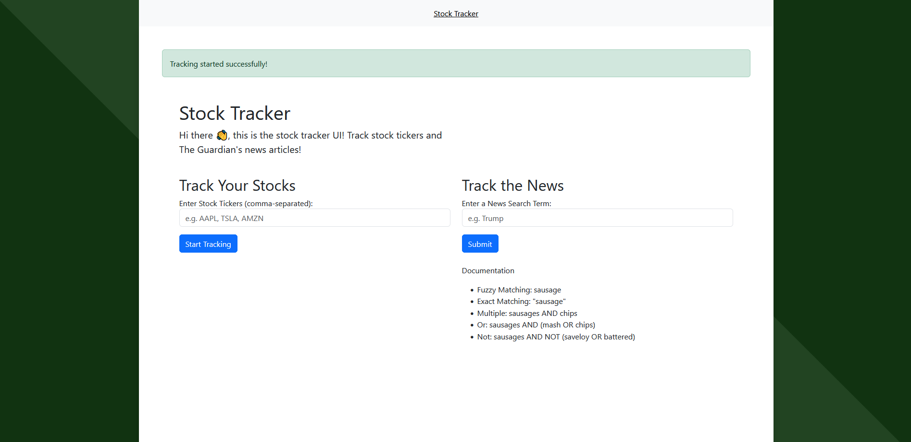

# Real-Time Stock Prices & News

This project utilizes Polygon's live stream and The Guardian's API to showcase real-time stock prices and news to watch for causation and signals in regards to day trading. 

[](https://github.com/cmgoffena13/DE-Capstone-Portfolio-2/actions/workflows/build.yml)


## Technologies Used
 
 
 
 
 ![Iceberg](https://img.shields.io/badge/-Iceberg-lightblue?style=flat&logoColor=white&logo=data:image/png;base64,iVBORw0KGgoAAAANSUhEUgAAADAAAAAwCAYAAABXAvmHAAAACXBIWXMAAAsTAAALEwEAmpwYAAAFBUlEQVR4nO2ZXUxbZRjH3/Me5o1mJl6YXciFNxpjYlyMmuiFZjHGq+1yww23hbgxEOMKKR+DthQdzdg03knkYyDQljBgjBUQ+8HHoHyFAoXohcjYGMMMBFt66Okpj3lPP+jHaSlS2pL0nzxJeXrOef+/0/97njYglFRSSSUVSt3LjrL6eVaMDqO6F+GluQ0ne3eJ3SozMa+iwybDisPwcHMbptedIDPbB6V6SEGJrPvLzorSGbuCvNY8gY/mLdtAAEj9+IcDZGZWihJVHYvsuxOrnKPUzELpjF02tso99ZgndXeJg1Kz3SGdYT9AiSY9QMrEGrc2suoEHsDMQusjzmveEyPSl5nZecU4vEjO+1S/abhotEni7R/pnjrvEZOGvzkvgBAEiZHrE2IbiPk3NDY42c+w8ln7m3Ez37nkOOXJuuaJP0AghCtGrv7J/i0gAMe7GZCa2bkKEzwfc/OaZ3B06h+O8RhseRQM4AvhiZE7SvCxjuEhLo3aQTbD1sYcYGCFG/eNSP2CMIAvhDdGZhauTdvhvV4bfGJg+L/lZvuFmJnXLHM5Cz7mSVX+uWMuFIRvjEjlTbLwdjcDhdN2MiusUdsPtNq6RqutgO5svuJtKm2ppEdKv8JxHuPDz5x8j1SuacecaJIN6tf9xQX1s8btcG54y68fYt21yAFUVhU5CastGv5iSlsqVlm6PAuc0DNgXHXy5k/oGO/Cr2tsvCli5rX7toj7F0fsfn3BdVVWVcQAR5qsx2m1hfFc0FtKi4VWbkBwfwPoxvXgPuk1hTheuYe+2sIQT3sIEUIpTZvvY7W1l4+TyrqOGze0+OacHd+cBbpmBWjlv66qWQF8wwxYMgj0T4suA8R05SJgyQPA0uHg42/NgeB1bnn7DlpltZC1iQfiBe1LN8zHsGLqMVZMgWCVjQPO14au0hHh8xRhaxZVmKIwHyrHj+ByU3/YxeSj4QEK9IDLTXuGoBSm/c8HSmGq3HUxmTE8ACnZ8B7Mm4Aq7AMq+97v+wbAMqMRfzcRfkHp0O4ABVrA1yfDX+f6JFBiLVDnG4A6UwUop/OzfQOgsr5UXKBzkE0aMgYlg7sDkCKbWuj8byeAEnUBdfY2UKd/dtXlljEUNUkeZPN3MF8HWEKiEABS3B8ZADnf99OUjwL+qgOotOod46Q+r3UiUVtq9ADIXigeGPMaKdQDlo8ALncbKTJECKAFfK0fsGQI8JVWoM74mPatzLY6FHVJjUdxoYHxM1PU53qEFugiB8jXCps+7a4v6m1I2vwcOhCVDJ4SNCT+LWoAKLszBx2kcPFgR5ChvF8Bi7r2D5CheogOXFJ9ClVkWPN/ROp4A/gbzf8HSKsGJOqM0Y9+ufEdXKDb9jOVoXRtyqu7QwhG51KLHsVStGSoIjBGrjtZBfhq194AztZyKLfnZRRrUUV9C4ExckHUAM7tiRzgSusPKC7ip7TB4RejnbsKOE8Yws/8hcYNJAWM4ibvlPaJkRfiNmDyhAoJUEW+76SjeMs7pX1j5Kn0OsDiXmGAL5vnUEKIn9J6W1CM3IXP/wJYHACQVr2Nvta8hRJG7ikdFCM+5w2P6ZKhej+AzLZ2lGjip3RgjM7VMSir+Rh5n5YMq8l+odLrWJSlfwElnNxTmspQuWNS60SXWz70PQSXDPTirPbE/V8BIlNa1MPyv6iy2q+iwyhKrPueyrzTFG8fSSWVFEp8/QeVT2ObJXLy9wAAAABJRU5ErkJggg==)
 
 
 
  
  
  
  
 


## Design


## Table of Contents
1. [Introduction](#Introduction)
2. [Technology Choices](#Technology-Choices)
3. [Initial Data Investigations - Polygon Websocket](#Initial-Data-Investigations---Polygon-Websocket)
    1. [Real-Time Websocket Feed](#Real-Time-Websocket-Feed)
4. [Initial Data Investigations - The Guardian API](#Initial-Data-Investigations---The-Guardian-API)
    1. [Content Endpoint](#Content-Endpoint)
5. [Website](#Website)
6. [Threading](#Threading)
7. [Watermarking](#Watermarking)

## Introduction
This portfolio project is designed to showcase my ability to learn new technologies in regards to streaming. Almost every technology chosen in this project I had limited knowledge in. Each section is commentary on the project that includes my learnings along the way. Enjoy!

## Technology Choices
From a skillset perspective I am proficient in SQL and Python, which led me to choose these tools:
 - **Python**: easiest way to access Polygon's real-time websocket and The Guardian's API to get the data and send it to Kafka as a buffer.
 - **Kafka**: a buffer to collect the results of the streams as a temporary storage. This is the de-facto tool for real-time message brokers. Checked out RabbitMQ but Kafka is better for real-time.
 - **Flink**: the de-facto tool for streaming with minimal latency. I had already worked with Spark, so I wanted to expand my skillset here.
 - **Iceberg**: Iceberg was created for streaming, gracefully handling appends. Works great with open source.
 - **AWS**: I used AWS for my last project and really enjoyed the ease of use and UI. So here we are again. 
 - **Flask**: I am proficient in Flask web development and I wanted a web page so that I could easily adjust the stream inputs.
 - **InfluxDB**: I wanted to originally use Prometheus, but Prometheus doesn't support inserting of data, just scraping websites. Needed a time-series database that supported inserts from Flink, so decided on the popular InfluxDB.
 - **Grafana**: Free dashboard tool designed for real-time data. I had already used Prometheus before, so it made sense to gain proficiency in Grafana since they work so well together.
 - **Docker**: great way to re-produce environments and easily create a network using docker-compose.

## Initial Data Investigations - Polygon Websocket
I am already subscribed to some polygon endpoints and with that subscription comes access to their 15 min delay websocket. Polygon is a great data resource that I was excited to use again.

### Real-Time Websocket Feed
Feed: <a>delayed.polygon.io</a>

**Results**
```json

```

## Initial Data Investigations - The Guardian API
The guardian is a well-respected news outlet that focuses on the US. It offers a free API key for development/non-profit purposes. I've had my eye on The Guardian ever since they helped Edward Snowden get the word out about the NSA's surveillance activities.

### Content Endpoint
URL: https://content.guardianapis.com/search

**Results**
```json
{
  "response": {
    "status": "ok",
    "userTier": "developer",
    "total": 28465,
    "startIndex": 1,
    "pageSize": 1,
    "currentPage": 1,
    "pages": 28465,
    "orderBy": "relevance",
    "results": [
      {
        "id": "global-development/2024/dec/22/exclusive-photographs-reveal-first-glimpse-of-uncontacted-amazon-community-massaco",
        "type": "article",
        "sectionId": "global-development",
        "sectionName": "Global development",
        "webPublicationDate": "2024-12-22T05:00:36Z",
        "webTitle": "Photographs reveal first glimpse of uncontacted Amazon community",
        "webUrl": "https://www.theguardian.com/global-development/2024/dec/22/exclusive-photographs-reveal-first-glimpse-of-uncontacted-amazon-community-massaco",
        "apiUrl": "https://content.guardianapis.com/global-development/2024/dec/22/exclusive-photographs-reveal-first-glimpse-of-uncontacted-amazon-community-massaco",
        "isHosted": False,
        "pillarId": "pillar/news",
        "pillarName": "News"
      }
    ]
  }
}
```
<sup>Initial thoughts: webTitle and webPublicationDate seem to be the most important data points. Status is important as well to check. Also have to be careful about search terms, I wanted the ecommerce Amazon, not the jungle. Looks like their is a sectionName that can be filtered for US activity only</sup>

## Website
I decided early on that I wanted to create a web page to easily change the polygon and guardian query inputs. I ended up with a simple flask home page.


## Threading
One of the main issues I ran into while using the flask home page is when submitting a form, the websocket held the main python thread, which never ended up reloading the page. I ended up with a simple solution to create a background thread for the websocket to have the web page load properly after a form submission.
```python
    def start_websocket(self, ws):
        def run_ws():
            with self.app.app_context():
                current_app.logger.debug("Starting Stream...")
            ws.run(handle_msg=self._handle_msg)

        threading.Thread(target=run_ws).start()
        with self.app.app_context():
            current_app.logger.debug("Stream Started")
```

## Watermarking
One of the challenges with The Guardian's API is that it only allowed to search through articles for a specific date. That means I could continuously query the API, but I would keep getting old results. I utilized the `webPublicationDate` timestamp field in the results to ensure only new articles were added to the kafka topic by maintaining a watermark timestamp and comparing the two fields.